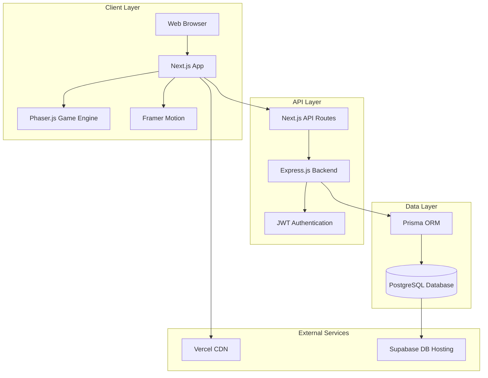
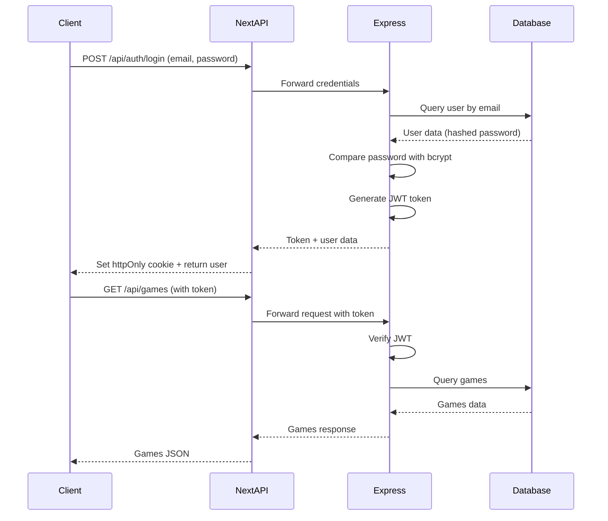
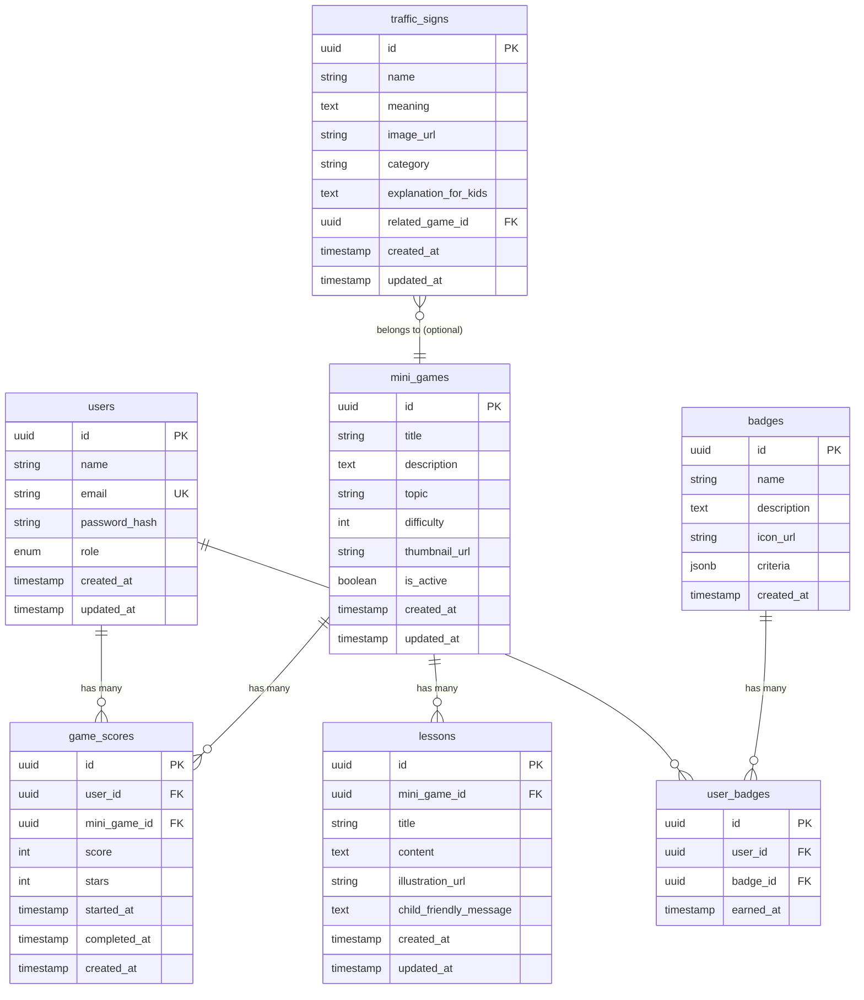

# Tài Liệu Thiết Kế - Traffic Kids (Bé Vui Giao Thông)

## Overview

Traffic Kids là web application giáo dục giao thông cho trẻ em từ 6-11 tuổi, được thiết kế theo kiến trúc client-server với frontend Next.js và backend Node.js. Hệ thống cung cấp 5 mini game tương tác giúp trẻ học các quy tắc an toàn giao thông thông qua gameplay trực quan và thú vị.

### Design Philosophy

Traffic Kids áp dụng thiết kế child-friendly với các nguyên tắc:
- **Visual-First Communication**: Ưu tiên hình ảnh và icon thay vì text
- **Positive Reinforcement**: Sử dụng ngôn ngữ khích lệ, tránh phủ định
- **Cognitive Load Reduction**: Giao diện đơn giản với tối đa 3-4 lựa chọn mỗi lần
- **Immediate Feedback**: Phản hồi tức thì cho mọi hành động
- **Safe Learning Environment**: Không có hình ảnh bạo lực hoặc nội dung đe dọa

### Design Read

**Reading this as:** Educational game hub for children aged 6-11, with a playful colorful language optimized for touch interactions, leaning toward Phaser.js game engine + Next.js + child-friendly UI patterns with large touch targets, bright colors, and positive reinforcement messaging.

### Core Design Values

1. **Safety First**: Mọi nội dung đều được thiết kế để dạy về an toàn giao thông mà không gây sợ hãi
2. **Age-Appropriate**: Vocabulary, gameplay và visual complexity phù hợp với trẻ 6-11 tuổi
3. **Accessibility**: Large touch targets (minimum 60px), high contrast, clear icons
4. **Engagement**: Gamification với stars, badges, mascot để duy trì động lực

## Architecture

### System Architecture Overview



### Technology Stack

#### Frontend
- **Framework**: Next.js 14+ with App Router and Server Components
- **Language**: TypeScript 5+
- **Styling**: Tailwind CSS v4
- **Animation**: Framer Motion (imported from `motion/react`)
- **Game Engine**: Phaser.js 3.x for interactive mini-games
- **Icons**: @phosphor-icons/react (primary), hugeicons-react (secondary)
- **State Management**: Zustand for global state, React Context for game state
- **HTTP Client**: Fetch API with custom hooks

#### Backend
- **Runtime**: Node.js 18+ LTS
- **Framework**: Express.js 4.x
- **Language**: TypeScript
- **ORM**: Prisma 5.x
- **Authentication**: JWT (jsonwebtoken + bcryptjs)
- **Validation**: Zod for schema validation
- **API Documentation**: OpenAPI/Swagger (optional)

#### Database
- **DBMS**: PostgreSQL 15+
- **Hosting**: Supabase (production), Local PostgreSQL (development)
- **Migration Tool**: Prisma Migrate
- **Seeding**: Prisma seed scripts

#### DevOps & Deployment
- **Frontend Hosting**: Vercel (automatic deployment from Git)
- **Backend Hosting**: Render or Railway
- **Database**: Supabase PostgreSQL
- **CI/CD**: GitHub Actions (optional)
- **Monitoring**: Vercel Analytics, Sentry (error tracking)

### Architecture Layers

#### 1. Presentation Layer (Client)
- **Pages**: Next.js App Router pages (`app/` directory)
- **Components**: Reusable React components
- **Game Components**: Phaser.js scenes and game objects
- **Layouts**: Shared layouts with navigation
- **Assets**: Images, sounds, fonts in `public/`

#### 2. Application Layer (Client & Server)
- **API Routes**: Next.js API routes for server-side logic
- **Client Services**: API client functions and hooks
- **Game Logic**: Phaser scenes, game mechanics
- **State Management**: Zustand stores, React Context providers

#### 3. Business Logic Layer (Server)
- **Controllers**: Express route handlers
- **Services**: Business logic (game scoring, badge awarding)
- **Middleware**: Authentication, validation, error handling
- **Utilities**: Helper functions, constants

#### 4. Data Access Layer (Server)
- **Repositories**: Prisma client queries
- **Models**: Prisma schema definitions
- **Migrations**: Database version control
- **Seeders**: Initial data population

### Security Architecture

#### Authentication Flow


#### Security Measures
1. **Password Security**: bcrypt hashing with salt rounds = 10
2. **Token Management**: JWT with 7-day expiration, httpOnly cookies
3. **Input Validation**: Zod schemas on all API inputs
4. **SQL Injection Prevention**: Prisma parameterized queries
5. **XSS Prevention**: React automatic escaping + CSP headers
6. **CSRF Protection**: SameSite cookie attribute
7. **Rate Limiting**: Express rate-limit middleware (100 requests/15 minutes)

## Components and Interfaces

### Frontend Component Hierarchy

```
App Layout
├── NavigationBar
│   ├── Logo
│   ├── NavLinks (Home, Games, Progress, Profile)
│   └── UserMenu
│
├── Game Hub Page
│   ├── WelcomeScreen (first visit)
│   │   └── MascotIntro (Bé An)
│   ├── CityMapLayout
│   │   ├── GameZone (x5)
│   │   │   ├── GameIcon
│   │   │   ├── GameTitle
│   │   │   └── StarDisplay
│   │   └── MascotCharacter
│   └── ProgressSummary
│
├── Mini Game Layouts (x5)
│   ├── GameHeader
│   │   ├── BackButton
│   │   ├── ScoreDisplay
│   │   └── TimerDisplay (if applicable)
│   ├── PhaserGameCanvas
│   │   └── [Phaser Scene]
│   └── GameControls
│       ├── ActionButtons (large, 60px+)
│       └── HelpButton
│
├── Result Screen
│   ├── ScoreCard
│   │   ├── StarRating (1-3 stars)
│   │   ├── PointsEarned
│   │   └── BadgeAwarded (if any)
│   ├── LessonCard
│   │   ├── LessonTitle
│   │   ├── LessonContent (max 100 words)
│   │   └── LessonIllustration
│   └── ActionButtons
│       ├── ReplayButton
│       └── HomeButton
│
├── Progress Page
│   ├── ProgressHeader
│   │   ├── TotalScore
│   │   └── BadgeCollection
│   ├── GameProgressGrid (5 cards)
│   │   ├── GameThumbnail
│   │   ├── BestStars
│   │   └── PlayCount
│   └── BadgeShowcase
│
└── Auth Pages
    ├── LoginForm
    └── RegisterForm
```

### Key React Components

#### GameHub.tsx
```typescript
interface GameHubProps {
  games: MiniGame[];
  userProgress: UserProgress;
  onGameSelect: (gameId: string) => void;
}
```

#### PhaserGameContainer.tsx
```typescript
interface PhaserGameContainerProps {
  gameType: GameType;
  onGameComplete: (score: number) => void;
  onGameExit: () => void;
}
```

#### ResultScreen.tsx
```typescript
interface ResultScreenProps {
  score: number;
  stars: number;
  badges: Badge[];
  lesson: Lesson;
  onReplay: () => void;
  onHome: () => void;
}
```

### Backend API Interfaces

#### REST API Endpoints

**Authentication Endpoints**
```
POST   /api/auth/register
POST   /api/auth/login
POST   /api/auth/logout
GET    /api/auth/me
```

**Game Endpoints**
```
GET    /api/games                    # List all active mini games
GET    /api/games/:id                # Get single game details
POST   /api/games/:id/sessions       # Start a game session
PUT    /api/games/sessions/:id       # Update session (score)
POST   /api/games/sessions/:id/complete  # Complete session
```

**User Progress Endpoints**
```
GET    /api/users/progress           # Get current user progress
GET    /api/users/badges             # Get user badges
GET    /api/users/scores             # Get score history
```

**Lesson Endpoints**
```
GET    /api/lessons/:gameId          # Get lesson for a game
```

**Admin Endpoints**
```
GET    /api/admin/games              # List all games (including inactive)
POST   /api/admin/games              # Create game
PUT    /api/admin/games/:id          # Update game
DELETE /api/admin/games/:id          # Soft delete game

GET    /api/admin/lessons            # List all lessons
POST   /api/admin/lessons            # Create lesson
PUT    /api/admin/lessons/:id        # Update lesson

GET    /api/admin/traffic-signs      # List all traffic signs
POST   /api/admin/traffic-signs      # Create traffic sign
PUT    /api/admin/traffic-signs/:id  # Update traffic sign

GET    /api/admin/stats              # System statistics
```

### API Request/Response Schemas

#### POST /api/auth/register


**Request:**
```json
{
  "name": "Minh Anh",
  "email": "minhanh@example.com",
  "password": "SecurePass123",
  "role": "player"
}
```

**Response (201 Created):**
```json
{
  "user": {
    "id": "uuid",
    "name": "Minh Anh",
    "email": "minhanh@example.com",
    "role": "player",
    "created_at": "2024-01-15T10:30:00Z"
  },
  "token": "eyJhbGciOiJIUzI1NiIsInR5cCI6IkpXVCJ9..."
}
```

#### POST /api/games/:id/sessions

**Request:**
```json
{
  "game_id": "uuid"
}
```

**Response (201 Created):**
```json
{
  "session_id": "uuid",
  "game_id": "uuid",
  "started_at": "2024-01-15T11:00:00Z",
  "status": "in_progress"
}
```

#### POST /api/games/sessions/:id/complete

**Request:**
```json
{
  "score": 85,
  "completed_at": "2024-01-15T11:05:30Z"
}
```

**Response (200 OK):**
```json
{
  "session": {
    "id": "uuid",
    "score": 85,
    "stars": 3,
    "completed_at": "2024-01-15T11:05:30Z"
  },
  "badges_earned": [
    {
      "id": "uuid",
      "name": "Người Qua Đường Siêu Sao",
      "description": "Hoàn thành Đèn Xanh với 3 sao",
      "icon_url": "/badges/crossing-star.png"
    }
  ],
  "lesson": {
    "id": "uuid",
    "title": "Đèn Xanh Đỏ Vàng",
    "content": "Khi đèn xanh, bé có thể sang đường. Khi đèn đỏ, bé phải dừng lại và chờ...",
    "illustration_url": "/lessons/traffic-light.png"
  }
}
```

#### GET /api/users/progress

**Response (200 OK):**
```json
{
  "total_score": 420,
  "total_sessions": 15,
  "games_progress": [
    {
      "game_id": "uuid",
      "game_title": "Đèn Xanh Qua Đường",
      "best_score": 95,
      "best_stars": 3,
      "play_count": 4,
      "last_played": "2024-01-15T11:05:30Z"
    }
  ],
  "badges": [
    {
      "id": "uuid",
      "name": "Người Qua Đường Siêu Sao",
      "earned_at": "2024-01-15T11:05:30Z"
    }
  ]
}
```

### API Error Response Format

All errors follow consistent format:

```json
{
  "error": {
    "code": "VALIDATION_ERROR",
    "message": "Email đã được sử dụng",
    "details": {
      "field": "email",
      "value": "existing@example.com"
    }
  }
}
```

**Error Codes:**
- `VALIDATION_ERROR`: Input validation failed
- `AUTHENTICATION_ERROR`: Invalid credentials
- `AUTHORIZATION_ERROR`: Insufficient permissions
- `NOT_FOUND`: Resource not found
- `RATE_LIMIT_EXCEEDED`: Too many requests
- `INTERNAL_ERROR`: Server error

## Data Models

### Database Schema (Prisma)

#### Entity Relationship Diagram



### Prisma Schema Definition

```prisma
// schema.prisma

generator client {
  provider = "prisma-client-js"
}

datasource db {
  provider = "postgresql"
  url      = env("DATABASE_URL")
}

model User {
  id            String       @id @default(uuid())
  name          String
  email         String       @unique
  password_hash String
  role          Role         @default(PLAYER)
  created_at    DateTime     @default(now())
  updated_at    DateTime     @updatedAt
  
  game_scores   GameScore[]
  user_badges   UserBadge[]
  
  @@map("users")
}

enum Role {
  PLAYER
  GUARDIAN
  ADMIN
}

model MiniGame {
  id            String       @id @default(uuid())
  title         String
  description   String       @db.Text
  topic         String
  difficulty    Int          @default(1)
  thumbnail_url String
  is_active     Boolean      @default(true)
  created_at    DateTime     @default(now())
  updated_at    DateTime     @updatedAt
  
  game_scores   GameScore[]
  lessons       Lesson[]
  traffic_signs TrafficSign[]
  
  @@map("mini_games")
}

model GameScore {
  id            String    @id @default(uuid())
  user_id       String
  mini_game_id  String
  score         Int
  stars         Int
  started_at    DateTime
  completed_at  DateTime?
  created_at    DateTime  @default(now())
  
  user          User      @relation(fields: [user_id], references: [id], onDelete: Cascade)
  mini_game     MiniGame  @relation(fields: [mini_game_id], references: [id], onDelete: Cascade)
  
  @@index([user_id])
  @@index([mini_game_id])
  @@index([completed_at])
  @@map("game_scores")
}

model Lesson {
  id                      String    @id @default(uuid())
  mini_game_id            String
  title                   String
  content                 String    @db.Text
  illustration_url        String
  child_friendly_message  String    @db.Text
  created_at              DateTime  @default(now())
  updated_at              DateTime  @updatedAt
  
  mini_game               MiniGame  @relation(fields: [mini_game_id], references: [id], onDelete: Cascade)
  
  @@map("lessons")
}

model Badge {
  id          String       @id @default(uuid())
  name        String
  description String       @db.Text
  icon_url    String
  criteria    Json
  created_at  DateTime     @default(now())
  
  user_badges UserBadge[]
  
  @@map("badges")
}

model UserBadge {
  id         String   @id @default(uuid())
  user_id    String
  badge_id   String
  earned_at  DateTime @default(now())
  
  user       User     @relation(fields: [user_id], references: [id], onDelete: Cascade)
  badge      Badge    @relation(fields: [badge_id], references: [id], onDelete: Cascade)
  
  @@unique([user_id, badge_id])
  @@index([user_id])
  @@map("user_badges")
}

model TrafficSign {
  id                   String    @id @default(uuid())
  name                 String
  meaning              String    @db.Text
  image_url            String
  category             String
  explanation_for_kids String    @db.Text
  related_game_id      String?
  created_at           DateTime  @default(now())
  updated_at           DateTime  @updatedAt
  
  related_game         MiniGame? @relation(fields: [related_game_id], references: [id], onDelete: SetNull)
  
  @@index([category])
  @@map("traffic_signs")
}
```

### Database Indexes

**Performance Optimization Indexes:**

1. `game_scores(user_id)` - Fast user progress queries
2. `game_scores(mini_game_id)` - Fast game statistics queries
3. `game_scores(completed_at)` - Recent activity queries
4. `user_badges(user_id)` - Fast badge collection retrieval
5. `traffic_signs(category)` - Category filtering in games
6. `users(email)` - Unique constraint + fast login queries

### Migration Strategy

1. **Initial Migration**: Create all tables with base schema
2. **Seed Data**: Populate mini_games, lessons, traffic_signs, badges
3. **Version Control**: Each schema change = new migration file
4. **Rollback Plan**: Maintain down migrations for critical changes
5. **Production Deployment**: Blue-green deployment with migration pre-check

**Migration Commands:**
```bash
# Create migration
npx prisma migrate dev --name init

# Apply to production
npx prisma migrate deploy

# Reset database (dev only)
npx prisma migrate reset

# Generate Prisma Client
npx prisma generate
```

### Data Validation Rules

**User Model:**
- `name`: 2-50 characters, Unicode support for Vietnamese names
- `email`: RFC 5322 compliant, max 255 characters
- `password`: Min 8 characters (stored as bcrypt hash)

**GameScore Model:**
- `score`: 0-100 integer
- `stars`: 1-3 integer
- `completed_at`: Must be after `started_at`

**Lesson Model:**
- `content`: Max 500 characters (100 words ≈ 500 chars in Vietnamese)
- `child_friendly_message`: Validated against forbidden words list

**Badge Criteria JSON Schema:**
```json
{
  "type": "object",
  "properties": {
    "condition": {
      "enum": ["all_games_3_stars", "total_score", "play_count"]
    },
    "threshold": {
      "type": "number"
    }
  }
}
```


## Correctness Properties

*A property is a characteristic or behavior that should hold true across all valid executions of a system—essentially, a formal statement about what the system should do. Properties serve as the bridge between human-readable specifications and machine-verifiable correctness guarantees.*

### Property Reflection

After analyzing all acceptance criteria, I identified the following redundancies to eliminate:

**Redundant Properties Identified:**
1. **Game completion flow** (Requirements 2.6, 3.6, 4.6, 6.6): All mini-games navigate to Result_Screen after completion. Can be combined into one property about game session lifecycle.
2. **UI button size constraints** (Requirements 1.4, 9.3): Both require minimum touch target sizes. Can be combined into one comprehensive property.
3. **Child-friendly message validation** (Requirements 9.8, 14.3): Both test message appropriateness. Can be combined into single content validation property.
4. **Score persistence** (Requirements 7.3, 10.6, 13.3): Multiple requirements about data persistence. Can combine into round-trip persistence property.
5. **Admin CRUD validation** (Requirements 12.2, 12.3, 12.4): All test required field validation for different entities. Can generalize into entity creation validation property.

**Properties After Consolidation:**
The following correctness properties represent unique validation value after removing logical redundancies.

### Property 1: Navigation Performance Within Latency Bounds

*For any* Game_Hub game zone click event, navigation to the target game screen should complete within 500 milliseconds.

**Validates: Requirements 1.2**

### Property 2: Touch Target Minimum Dimensions

*For any* interactive button or draggable element in the interface, the rendered height and width should be at least 60 pixels (buttons) or 80 pixels (draggable items).

**Validates: Requirements 1.4, 4.5, 9.3**

### Property 3: Green Light Crossing Reward

*For any* traffic light in green state in the Đèn Xanh mini-game, when the player character crosses, the score should increase by exactly 10 points.

**Validates: Requirements 2.2**

### Property 4: Red Light Crossing Penalty

*For any* traffic light in red state in the Đèn Xanh mini-game, when the player character crosses, the score should decrease by exactly 5 points and a child-friendly warning message should be displayed.

**Validates: Requirements 2.3**

### Property 5: Traffic Light Cycle Timing Bounds

*For any* traffic light state transition in the Đèn Xanh mini-game, the duration in the current state should be between 3 and 7 seconds before transitioning.

**Validates: Requirements 2.5**

### Property 6: Game Session Lifecycle Completion

*For any* mini-game, when a game session ends (regardless of score), the system should navigate to the Result_Screen displaying score, stars, and the associated lesson.

**Validates: Requirements 2.6, 3.6, 4.6, 6.6**

### Property 7: Observation Sequence Scoring

*For any* correct observation sequence (left → right → left) in the Nhìn Trái Nhìn Phải mini-game, the system should award 5 points per observation step plus 15 bonus points for safe crossing, totaling 30 points for the complete sequence.

**Validates: Requirements 3.2**

### Property 8: Out-of-Order Observation Feedback

*For any* observation sequence that deviates from the correct order (left → right → left), the system should display a child-friendly message explaining the correct sequence without advancing the game state.

**Validates: Requirements 3.3**

### Property 9: Vehicle Approach Crossing Prevention

*For any* game state in Nhìn Trái Nhìn Phải where vehicles are approaching, attempting to cross should be blocked and a child-friendly wait message should be displayed.

**Validates: Requirements 3.5**

### Property 10: Correct Helmet Selection Reward

*For any* correct helmet item dragged onto the character in Đội Mũ mini-game, the score should increase by exactly 10 points.

**Validates: Requirements 4.2**

### Property 11: Incorrect Item Feedback

*For any* incorrect item (non-helmet) dragged onto the character in Đội Mũ mini-game, the system should display a child-friendly educational message explaining why it is unsafe, without awarding points.

**Validates: Requirements 4.3**

### Property 12: Helmet Strap Completion Bonus

*For any* game state in Đội Mũ where the correct helmet is placed AND the chin strap is clicked, the system should award 10 bonus points in addition to the base helmet points.

**Validates: Requirements 4.4**

### Property 13: Correct Sign Selection Reward

*For any* correct traffic sign selected for a given scenario in Biển Báo mini-game, the score should increase by 10 points and an explanatory child-friendly message should be displayed.

**Validates: Requirements 5.2**

### Property 14: Incorrect Sign Educational Feedback

*For any* incorrect traffic sign selected in Biển Báo mini-game, the system should display a child-friendly message explaining the correct sign without awarding points.

**Validates: Requirements 5.3**

### Property 15: Sign Question Randomization

*For any* two consecutive game sessions of Biển Báo mini-game by the same player, the set of traffic sign questions should differ (different signs or different order).

**Validates: Requirements 5.6**

### Property 16: Safe Path Selection Reward

*For any* safe path option selected (sidewalk, pedestrian crossing) in Đường Đến Trường mini-game, the score should increase by 10 points.

**Validates: Requirements 6.2**

### Property 17: Unsafe Path Educational Feedback

*For any* unsafe path option selected in Đường Đến Trường mini-game, the system should display a child-friendly message explaining the danger and suggesting the safe alternative without awarding points.

**Validates: Requirements 6.3**

### Property 18: Score-to-Stars Mapping

*For any* completed game session score, the star rating should be: 1 star for scores 0-40, 2 stars for scores 41-70, and 3 stars for scores 71+.

**Validates: Requirements 7.2**

### Property 19: Game Score Persistence Round-Trip

*For any* completed game session, saving the score and stars to the database and then retrieving the user's progress should return the same score and star values.

**Validates: Requirements 7.3, 10.6, 13.3**

### Property 20: Milestone Badge Awarding

*For any* player achieving a defined milestone (complete all 5 games with 3 stars, reach 500 total points, play 10 sessions), the appropriate badge should be awarded and associated with the user account.

**Validates: Requirements 7.4**

### Property 21: High Score Retention

*For any* mini-game replay by a player, if the new score is less than or equal to the previous best score, the database should retain the higher score; if the new score is higher, it should replace the previous best.

**Validates: Requirements 7.6**

### Property 22: Lesson-Game Association

*For any* completed game session, the lesson displayed on the Result_Screen should be associated with the mini-game that was just played (matching mini_game_id).

**Validates: Requirements 8.1**

### Property 23: Lesson Illustration Presence

*For any* lesson displayed, the lesson object should contain a non-empty illustration_url field.

**Validates: Requirements 8.3**

### Property 24: Lesson Word Count Constraint

*For any* lesson content text, the word count should not exceed 100 words.

**Validates: Requirements 8.4**

### Property 25: Result Screen Navigation Controls

*For any* Result_Screen displayed after a game session, the screen should contain exactly one replay button and one home button.

**Validates: Requirements 8.5**

### Property 26: Color Semantic Consistency

*For any* UI element indicating a correct action, the color should be green; for stop/danger elements, the color should be red; for caution elements, the color should be yellow or orange; and the default background should be light blue.

**Validates: Requirements 9.2**

### Property 27: Typography Minimum Font Size

*For any* text element rendered in the interface, the font size should be at least 18 pixels.

**Validates: Requirements 9.5**

### Property 28: Animation Duration Cap

*For any* animation or transition effect in the interface, the duration should not exceed 500 milliseconds.

**Validates: Requirements 9.6**

### Property 29: Responsive Viewport Rendering

*For any* viewport width of 375px (mobile), 768px (tablet), or 1024px (desktop), the interface should render without horizontal scroll or layout collapse.

**Validates: Requirements 9.7**

### Property 30: Child-Friendly Message Content Validation

*For any* message displayed to the player, the text should use positive, encouraging language and should not contain words from the forbidden list (e.g., "sai rồi", "nguy hiểm chết người", "vi phạm luật").

**Validates: Requirements 9.8, 14.3**

### Property 31: Progress Display Completeness

*For any* player accessing the progress screen, the display should show completion status and best star count for all 5 mini-games, even if some have not been played yet (showing 0 stars).

**Validates: Requirements 10.1**

### Property 32: Badge Display with Timestamps

*For any* player with earned badges, the progress screen should display each badge along with its earned_at timestamp.

**Validates: Requirements 10.2**

### Property 33: Cumulative Score Accuracy

*For any* player, the total cumulative score displayed should equal the sum of all individual game session scores in the database for that user.

**Validates: Requirements 10.3**

### Property 34: Guardian View Data Consistency

*For any* guardian viewing a player's progress, the data displayed (games, scores, stars, badges) should match the data the player sees, with addition of session timestamps.

**Validates: Requirements 10.4**

### Property 35: Progress Update Timeliness

*For any* game session completion, querying the progress API within 2 seconds should return the updated data including the latest session.

**Validates: Requirements 10.5**

### Property 36: User Registration Role Assignment

*For any* valid registration request with name, email, and password, the created user account should have the role field set to "player".

**Validates: Requirements 11.1**

### Property 37: Password Hashing Enforcement

*For any* user account created, the password_hash field in the database should be a bcrypt hash (starting with "$2b$" or "$2a$"), not the plaintext password.

**Validates: Requirements 11.2**

### Property 38: JWT Token Issuance on Valid Login

*For any* login request with valid credentials, the response should include a JWT token with an expiration time exactly 7 days from issuance.

**Validates: Requirements 11.3**

### Property 39: Login Rejection on Invalid Credentials

*For any* login request with credentials that do not match any user record or have incorrect password, the request should return an error response and no token should be issued.

**Validates: Requirements 11.4**

### Property 40: Email Format Validation

*For any* registration request, the email field should be validated against RFC 5322 format before the account is created; invalid formats should be rejected.

**Validates: Requirements 11.5**

### Property 41: Password Minimum Length Validation

*For any* registration request, the password field should be at least 8 characters; shorter passwords should be rejected before account creation.

**Validates: Requirements 11.6**

### Property 42: Admin Dashboard Access Control

*For any* authenticated user with role "admin", the admin dashboard endpoints should be accessible; for users with role "player" or "guardian", admin endpoints should return authorization error.

**Validates: Requirements 12.1**

### Property 43: Entity Creation Required Field Validation

*For any* admin request to create or update a Mini_Game, Lesson, or Traffic_Sign, all required fields (as defined in the Prisma schema) should be present and non-empty; requests missing required fields should be rejected with validation error.

**Validates: Requirements 12.2, 12.3, 12.4**

### Property 44: Game Visibility Toggle

*For any* mini-game with is_active set to false, the game should not appear in the games list returned to player clients; when toggled back to true, it should reappear.

**Validates: Requirements 12.5**

### Property 45: Usage Statistics Accuracy

*For any* admin request for usage statistics, the returned data should accurately reflect: total user count (role="player" or "guardian"), total game sessions count, and average stars per mini-game calculated from game_scores table.

**Validates: Requirements 12.6**

### Property 46: Image Asset Size Constraint

*For any* image file served as a game asset, the file size should not exceed 500 kilobytes.

**Validates: Requirements 13.4**

### Property 47: Service Unavailability Error Handling

*For any* API request when the backend service or database is unavailable, the client should display an error message and provide a retry mechanism rather than crashing or hanging indefinitely.

**Validates: Requirements 13.5**

### Property 48: Lazy Loading Asset Strategy

*For any* mini-game that has not been selected by the player in the current session, the game-specific assets (Phaser scenes, images, sounds) should not be loaded until the player navigates to that game.

**Validates: Requirements 13.6**

### Property 49: Content Violence Exclusion

*For any* content (game assets, lesson text, messages), the content should not contain violent imagery or language as defined by a content moderation blacklist.

**Validates: Requirements 14.1**

### Property 50: Personal Data Collection Limitation

*For any* user registration or profile update, the system should only collect name and email fields; requests containing additional personal data fields (address, phone, birthdate beyond age verification) should not persist those fields.

**Validates: Requirements 14.2**

### Property 51: Admin Content Moderation Enforcement

*For any* admin-created or admin-updated lesson or message, the content should pass through a validation function checking age-appropriateness before being saved to the database.

**Validates: Requirements 14.5**

### Property 52: Under-13 Guardian Consent Requirement

*For any* registration attempt for a user indicated as under 13 years old, the registration flow should require guardian consent confirmation before account creation.

**Validates: Requirements 14.6**

### Property 53: Dynamic Game Display Without Code Changes

*For any* new mini_game record inserted into the database with is_active=true, the game should automatically appear in the Game_Hub on the next client request without requiring application code deployment.

**Validates: Requirements 15.2**

### Property 54: Traffic Sign Category Flexibility

*For any* traffic sign creation request with a new category value not previously in the database, the system should accept and store the new category without requiring database schema migration.

**Validates: Requirements 15.3**

### Property 55: Badge Custom Criteria Support

*For any* badge creation request through the admin interface with custom criteria defined in JSON format, the badge should be created and the criteria should be evaluable against user progress data.

**Validates: Requirements 15.4**

### Property 56: Lesson Dynamic Linkage

*For any* lesson creation request through the admin interface, the lesson should be linkable to any existing mini_game_id or to a new mini-game that does not yet exist in the database (forward reference).

**Validates: Requirements 15.5**


## Error Handling

### Error Handling Strategy

Traffic Kids implements a comprehensive error handling strategy with child-friendly messaging for client errors and detailed logging for system errors.

### Error Categories and Handling

#### 1. Client-Side Errors

**User Input Errors**
- **Validation Errors**: Display inline, child-friendly messages
  - Empty form fields: "Bé cần điền thông tin này nhé!"
  - Invalid email format: "Email chưa đúng định dạng"
  - Password too short: "Mật khẩu cần ít nhất 8 ký tự"
- **Handling**: Prevent form submission, show error near the input field, maintain other valid inputs

**Navigation Errors**
- **404 Not Found**: Display friendly "Game not found" screen with mascot and button to return home
- **Handling**: Catch-all route with child-friendly illustration, "Bé An không tìm thấy trang này"

**Game State Errors**
- **Invalid Action**: When player attempts disallowed game action
  - Examples: Crossing when vehicles approaching, selecting already-used item
- **Handling**: Visual feedback (shake animation), child-friendly message, no state change

#### 2. Network Errors

**Connection Failures**
- **No Internet**: "Không có kết nối mạng. Bé kiểm tra wifi nhé!"
- **Timeout**: "Tải lâu quá. Thử lại nhé!"
- **Handling**: Toast notification with retry button, preserve local game state

**API Errors**
- **4xx Client Errors**: Map to specific user-facing messages
  - 400 Bad Request → "Thông tin chưa hợp lệ"
  - 401 Unauthorized → "Bé cần đăng nhập lại"
  - 403 Forbidden → "Bé không có quyền truy cập"
  - 404 Not Found → "Không tìm thấy dữ liệu"
  - 429 Rate Limit → "Bé thử lại sau vài phút nhé!"
- **5xx Server Errors**: Generic friendly message
  - "Có lỗi xảy ra. Bé thử lại sau nhé!"
- **Handling**: Display toast or modal, provide retry action, log to error tracking service

#### 3. Game Logic Errors

**Score Calculation Errors**
- **Negative Score**: Clamp to 0
- **Score Overflow**: Cap at 100
- **Handling**: Silent correction with logging, display corrected value

**Session State Corruption**
- **Invalid Session ID**: Create new session, log anomaly
- **Mismatched Game/Session**: Reset session, return to Game Hub
- **Handling**: Graceful recovery, preserve user progress, log for investigation

**Asset Loading Errors**
- **Missing Game Assets**: Display placeholder, child-friendly message "Đang cập nhật game..."
- **Image Load Failure**: Show placeholder illustration, continue game if possible
- **Handling**: Fallback assets, graceful degradation, retry mechanism

#### 4. Database Errors

**Connection Errors**
- **Database Unavailable**: Display "Hệ thống bảo trì. Thử lại sau nhé!"
- **Handling**: Circuit breaker pattern, exponential backoff retry, queue operations locally if possible

**Constraint Violations**
- **Unique Constraint (duplicate email)**: "Email đã được sử dụng"
- **Foreign Key Violation**: Generic error, log details
- **Handling**: Catch at application layer, return specific error codes, never expose raw SQL

**Transaction Failures**
- **Deadlock**: Automatic retry up to 3 times
- **Rollback**: Preserve previous state, inform user of failure
- **Handling**: Transactional boundaries around multi-step operations (session complete + badge award)

#### 5. Authentication/Authorization Errors

**JWT Errors**
- **Expired Token**: Auto-redirect to login with message "Phiên đăng nhập hết hạn"
- **Invalid Token**: Clear token, redirect to login
- **Missing Token**: Redirect to login for protected routes
- **Handling**: Axios/Fetch interceptors, automatic token refresh (optional), secure token storage

**Permission Errors**
- **Insufficient Role**: "Bé không có quyền truy cập trang này"
- **Handling**: Role-based route guards, server-side validation, friendly redirect

### Error Response Format

**API Error Structure:**
```typescript
interface APIError {
  error: {
    code: ErrorCode;
    message: string;
    details?: Record<string, any>;
    timestamp: string;
  };
}

enum ErrorCode {
  VALIDATION_ERROR = 'VALIDATION_ERROR',
  AUTHENTICATION_ERROR = 'AUTHENTICATION_ERROR',
  AUTHORIZATION_ERROR = 'AUTHORIZATION_ERROR',
  NOT_FOUND = 'NOT_FOUND',
  RATE_LIMIT_EXCEEDED = 'RATE_LIMIT_EXCEEDED',
  DATABASE_ERROR = 'DATABASE_ERROR',
  INTERNAL_ERROR = 'INTERNAL_ERROR',
}
```

### Error Logging

**Client-Side Logging:**
- Tool: Sentry or similar error tracking
- Logged: All uncaught exceptions, API errors, navigation errors
- Context: User ID (if logged in), browser info, current route, game state
- Privacy: No logging of personal information beyond user ID

**Server-Side Logging:**
- Tool: Winston or Pino
- Logged: All errors, warnings, request failures
- Levels: ERROR (immediate action), WARN (investigate), INFO (audit trail)
- Context: User ID, endpoint, request ID, stack trace
- Rotation: Daily log files, 30-day retention

### Child-Friendly Error Messages Guidelines

**Tone:**
- Positive and encouraging
- Use "Bé" to address the child
- End with "nhé!" for friendly tone
- Avoid blame ("Bé nhập sai") → use suggestion ("Bé thử lại nhé!")

**Examples:**
- ✅ "Bé làm tốt lắm! Thử một lần nữa nhé!"
- ✅ "Không sao đâu! Bé tiếp tục chơi nhé!"
- ✅ "Bé cần chờ đèn xanh để qua đường an toàn"
- ❌ "Lỗi! Bé làm sai rồi!"
- ❌ "Hành động không hợp lệ"
- ❌ "Thất bại"

## Testing Strategy

### Testing Philosophy

Traffic Kids employs a dual testing approach combining unit tests for specific scenarios and property-based tests for universal correctness guarantees. This strategy ensures both concrete edge cases and general behaviors are validated.

### Testing Stack

**Unit Testing:**
- **Framework**: Jest 29+ with React Testing Library
- **Coverage Target**: 80% code coverage minimum
- **Focus**: Specific examples, edge cases, integration points

**Property-Based Testing:**
- **Framework**: fast-check (JavaScript/TypeScript property testing library)
- **Configuration**: Minimum 100 iterations per property test
- **Focus**: Universal properties across all inputs

**End-to-End Testing:**
- **Framework**: Playwright
- **Focus**: Complete user journeys, game flows

**Visual Regression Testing:**
- **Tool**: Percy or Chromatic (optional)
- **Focus**: UI component appearance across browsers

### Unit Testing Strategy

#### Frontend Unit Tests

**Component Tests (React Testing Library)**
```typescript
// Example: GameHub component
describe('GameHub Component', () => {
  test('displays welcome screen on first visit', () => {
    render(<GameHub firstVisit={true} games={mockGames} />);
    expect(screen.getByText('Bé An')).toBeInTheDocument();
    expect(screen.getByRole('button', { name: /bắt đầu/i })).toBeInTheDocument();
  });

  test('displays 5 game zones', () => {
    render(<GameHub games={mockGames} />);
    const gameZones = screen.getAllByRole('button', { name: /game/i });
    expect(gameZones).toHaveLength(5);
  });

  test('navigates to game on zone click', () => {
    const onGameSelect = jest.fn();
    render(<GameHub games={mockGames} onGameSelect={onGameSelect} />);
    fireEvent.click(screen.getByText('Đèn Xanh Qua Đường'));
    expect(onGameSelect).toHaveBeenCalledWith(mockGames[0].id);
  });
});
```

**Game Logic Tests (Phaser Scenes)**
```typescript
// Example: Traffic Light Game
describe('TrafficLightGame Scene', () => {
  let scene: TrafficLightScene;

  beforeEach(() => {
    scene = new TrafficLightScene();
    scene.create();
  });

  test('initializes with red or green light', () => {
    const lightState = scene.trafficLight.getState();
    expect(['red', 'green']).toContain(lightState);
  });

  test('awards 10 points for crossing on green', () => {
    scene.trafficLight.setState('green');
    const initialScore = scene.score;
    scene.crossRoad();
    expect(scene.score).toBe(initialScore + 10);
  });

  test('deducts 5 points for crossing on red', () => {
    scene.trafficLight.setState('red');
    const initialScore = scene.score;
    scene.crossRoad();
    expect(scene.score).toBe(initialScore - 5);
  });

  test('displays child-friendly message on red crossing', () => {
    scene.trafficLight.setState('red');
    scene.crossRoad();
    expect(scene.messageText.text).toContain('chờ đèn xanh');
  });
});
```

**API Client Tests**
```typescript
// Example: Auth API
describe('Auth API Client', () => {
  test('registers user with valid data', async () => {
    const mockUser = { name: 'Test User', email: 'test@example.com', password: 'password123' };
    const response = await authAPI.register(mockUser);
    expect(response.user.email).toBe(mockUser.email);
    expect(response.token).toBeDefined();
  });

  test('rejects registration with invalid email', async () => {
    const mockUser = { name: 'Test', email: 'invalid-email', password: 'password123' };
    await expect(authAPI.register(mockUser)).rejects.toThrow('Email đã được sử dụng');
  });

  test('authenticates user with valid credentials', async () => {
    const credentials = { email: 'test@example.com', password: 'password123' };
    const response = await authAPI.login(credentials);
    expect(response.token).toBeDefined();
  });
});
```

#### Backend Unit Tests

**Controller Tests**
```typescript
// Example: Game Sessions Controller
describe('GameSessionsController', () => {
  test('POST /api/games/:id/sessions creates new session', async () => {
    const response = await request(app)
      .post('/api/games/game-id-123/sessions')
      .set('Authorization', `Bearer ${validToken}`)
      .send()
      .expect(201);

    expect(response.body.session_id).toBeDefined();
    expect(response.body.status).toBe('in_progress');
  });

  test('POST /api/games/sessions/:id/complete awards correct stars', async () => {
    const response = await request(app)
      .post('/api/games/sessions/session-id-123/complete')
      .set('Authorization', `Bearer ${validToken}`)
      .send({ score: 85 })
      .expect(200);

    expect(response.body.session.stars).toBe(3); // 85 points → 3 stars
  });
});
```

**Service Layer Tests**
```typescript
// Example: Badge Service
describe('BadgeService', () => {
  test('awards badge when milestone reached', async () => {
    const user = await createMockUser();
    await completeAllGamesWithThreeStars(user);
    
    const badges = await badgeService.checkAndAwardBadges(user.id);
    expect(badges).toContainEqual(
      expect.objectContaining({ name: 'Người Qua Đường Siêu Sao' })
    );
  });

  test('does not award duplicate badges', async () => {
    const user = await createMockUser();
    await badgeService.awardBadge(user.id, 'badge-id-123');
    await badgeService.awardBadge(user.id, 'badge-id-123'); // duplicate attempt
    
    const userBadges = await badgeService.getUserBadges(user.id);
    const badgeCount = userBadges.filter(b => b.badge_id === 'badge-id-123').length;
    expect(badgeCount).toBe(1);
  });
});
```

### Property-Based Testing Strategy

Property-based tests use fast-check to verify universal behaviors across randomly generated inputs. Each test runs a minimum of 100 iterations.

#### Configuration
```typescript
import fc from 'fast-check';

const propertyTestConfig = {
  numRuns: 100, // minimum iterations
  verbose: true,
  seed: Date.now(), // reproducible with seed
};
```

#### Property Test Examples

**Property 18: Score-to-Stars Mapping**
```typescript
// Feature: traffic-kids-education-app, Property 18: For any completed game session score, the star rating should be: 1 star for scores 0-40, 2 stars for scores 41-70, and 3 stars for scores 71+
describe('Score to Stars Mapping Property', () => {
  test('correctly maps any score to star rating', () => {
    fc.assert(
      fc.property(
        fc.integer({ min: 0, max: 100 }), // generate scores 0-100
        (score) => {
          const stars = calculateStars(score);
          
          if (score <= 40) {
            expect(stars).toBe(1);
          } else if (score <= 70) {
            expect(stars).toBe(2);
          } else {
            expect(stars).toBe(3);
          }
        }
      ),
      propertyTestConfig
    );
  });
});
```

**Property 19: Game Score Persistence Round-Trip**
```typescript
// Feature: traffic-kids-education-app, Property 19: For any completed game session, saving the score and stars to the database and then retrieving the user's progress should return the same score and star values
describe('Score Persistence Round-Trip Property', () => {
  test('any saved score persists correctly through database round-trip', async () => {
    await fc.assert(
      fc.asyncProperty(
        fc.record({
          userId: fc.uuid(),
          gameId: fc.uuid(),
          score: fc.integer({ min: 0, max: 100 }),
          stars: fc.integer({ min: 1, max: 3 }),
        }),
        async (sessionData) => {
          // Save to database
          const savedSession = await gameScoreRepository.create(sessionData);
          
          // Retrieve from database
          const retrieved = await gameScoreRepository.findById(savedSession.id);
          
          // Verify round-trip
          expect(retrieved.score).toBe(sessionData.score);
          expect(retrieved.stars).toBe(sessionData.stars);
          expect(retrieved.user_id).toBe(sessionData.userId);
          expect(retrieved.mini_game_id).toBe(sessionData.gameId);
        }
      ),
      propertyTestConfig
    );
  });
});
```

**Property 37: Password Hashing Enforcement**
```typescript
// Feature: traffic-kids-education-app, Property 37: For any user account created, the password_hash field in the database should be a bcrypt hash, not the plaintext password
describe('Password Hashing Property', () => {
  test('any password is hashed before database storage', async () => {
    await fc.assert(
      fc.asyncProperty(
        fc.string({ minLength: 8, maxLength: 50 }), // generate passwords
        async (password) => {
          const user = await userService.createUser({
            name: 'Test User',
            email: `test${Date.now()}@example.com`,
            password,
          });
          
          const dbUser = await userRepository.findById(user.id);
          
          // Password hash should not be plaintext
          expect(dbUser.password_hash).not.toBe(password);
          
          // Password hash should be bcrypt format (starts with $2b$ or $2a$)
          expect(dbUser.password_hash).toMatch(/^\$2[ab]\$/);
          
          // Original password should verify against hash
          const isValid = await bcrypt.compare(password, dbUser.password_hash);
          expect(isValid).toBe(true);
        }
      ),
      propertyTestConfig
    );
  });
});
```

**Property 30: Child-Friendly Message Content Validation**
```typescript
// Feature: traffic-kids-education-app, Property 30: For any message displayed to the player, the text should use positive, encouraging language and should not contain words from the forbidden list
describe('Child-Friendly Message Property', () => {
  const forbiddenWords = ['sai rồi', 'nguy hiểm chết người', 'vi phạm luật', 'thất bại', 'lỗi'];
  
  test('any generated message does not contain forbidden words', () => {
    fc.assert(
      fc.property(
        fc.constantFrom(...Object.values(ChildFriendlyMessages)), // all predefined messages
        (message) => {
          const lowerMessage = message.toLowerCase();
          const containsForbidden = forbiddenWords.some(word => 
            lowerMessage.includes(word.toLowerCase())
          );
          expect(containsForbidden).toBe(false);
        }
      ),
      propertyTestConfig
    );
  });
});
```

**Property 2: Touch Target Minimum Dimensions**
```typescript
// Feature: traffic-kids-education-app, Property 2: For any interactive button or draggable element, the rendered height and width should be at least 60 pixels (buttons) or 80 pixels (draggable items)
describe('Touch Target Dimensions Property', () => {
  test('any interactive element meets minimum size requirements', () => {
    fc.assert(
      fc.property(
        fc.record({
          type: fc.constantFrom('button', 'draggable'),
          width: fc.integer({ min: 20, max: 200 }),
          height: fc.integer({ min: 20, max: 200 }),
        }),
        (element) => {
          const minSize = element.type === 'button' ? 60 : 80;
          
          if (element.width >= minSize && element.height >= minSize) {
            // Element meets requirements, should pass validation
            expect(validateTouchTarget(element)).toBe(true);
          } else {
            // Element too small, should fail validation
            expect(validateTouchTarget(element)).toBe(false);
          }
        }
      ),
      propertyTestConfig
    );
  });
});
```

### Integration Testing

**API Integration Tests:**
- Test complete request/response cycles
- Verify middleware execution order
- Test authentication flow end-to-end
- Validate error propagation

**Database Integration Tests:**
- Test Prisma queries against real PostgreSQL (test database)
- Verify foreign key constraints
- Test transaction rollbacks
- Validate migration correctness

### End-to-End Testing

**User Flow Tests (Playwright):**
```typescript
// Complete game session flow
test('player can complete full game session', async ({ page }) => {
  // Login
  await page.goto('/login');
  await page.fill('input[name="email"]', 'player@example.com');
  await page.fill('input[name="password"]', 'password123');
  await page.click('button[type="submit"]');
  
  // Navigate to Game Hub
  await expect(page).toHaveURL('/games');
  
  // Select a game
  await page.click('text=Đèn Xanh Qua Đường');
  await expect(page).toHaveURL(/\/games\/.*$/);
  
  // Play game (simplified)
  await page.waitForSelector('canvas'); // Phaser canvas
  // ... game interactions ...
  
  // Complete game
  await page.click('text=Hoàn thành');
  
  // Verify result screen
  await expect(page.locator('text=/[0-9]+ điểm/')).toBeVisible();
  await expect(page.locator('[data-testid="star-rating"]')).toBeVisible();
  await expect(page.locator('text=/Bài học/i')).toBeVisible();
  
  // Return to hub
  await page.click('text=Về trang chủ');
  await expect(page).toHaveURL('/games');
});
```

### Test Coverage Goals

**Overall Coverage:** 80% minimum

**Critical Path Coverage:** 95%+
- Authentication flows
- Game scoring logic
- Data persistence
- Badge awarding
- Progress calculation

**Component Coverage:** 85%+
- All game scenes
- Result screens
- Progress display
- Form components

**API Coverage:** 90%+
- All endpoints tested
- Error cases covered
- Validation tested

### Continuous Integration

**CI Pipeline (GitHub Actions):**
1. Install dependencies
2. Run linting (ESLint, Prettier)
3. Run type checking (TypeScript)
4. Run unit tests (Jest)
5. Run property tests (fast-check)
6. Run integration tests
7. Generate coverage report
8. Run E2E tests (Playwright)
9. Build application
10. Deploy to staging (on main branch)

**Pre-commit Hooks (Husky):**
- Run linter on staged files
- Run type checking
- Run affected unit tests
- Validate commit message format

### Testing Best Practices

1. **Test Isolation**: Each test should be independent, no shared state
2. **Test Data**: Use factories for consistent test data generation
3. **Async Handling**: Always await async operations, use proper timeout configuration
4. **Mock External Services**: Mock external APIs, use in-memory database for unit tests
5. **Descriptive Names**: Test names should clearly describe what is being tested
6. **Arrange-Act-Assert**: Structure tests clearly with setup, execution, verification
7. **Edge Cases**: Explicitly test boundary conditions (0, max values, empty arrays)
8. **Error Cases**: Test both success and failure paths
9. **Performance**: Keep unit tests fast (<50ms), mark slow tests
10. **Maintainability**: Refactor duplicated test code into helper functions

---

## Supplementary Documentation

**UI/UX Design System & Mini-Games Detailed Design:**  
See [design-ui-games.md](./design-ui-games.md) for:
- Complete design system (colors, typography, spacing, components)
- Detailed game mechanics for all 5 mini-games
- State machines and scoring algorithms
- Asset requirements and implementation notes
- Performance optimization strategies
- Security considerations

---

This completes the design document for Traffic Kids. The next phase is implementation with task breakdown.

